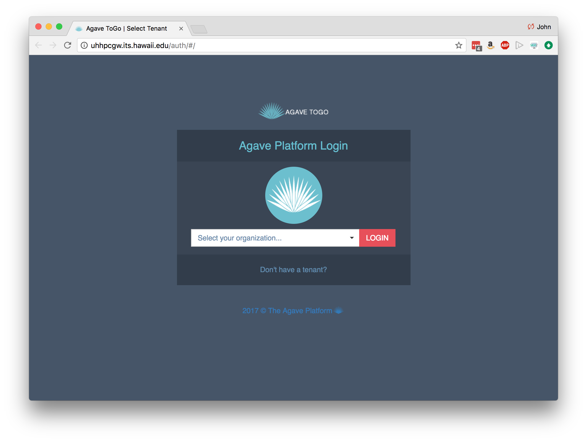

Tutorial: Getting Started with Agave CLI
===============================================
The following instructions will guide you through setting up Agave-based access to the University of Hawaii HPC system using the Agave ToGo web interface.  As an aside, everything we do today can also be accomplished from a command line interface or by directly calling API endpoints.  

The Agave CLI commands all respond with help for -h and return back information on the parameters that can be passed.  Also note that in Jupyter you can start typing a command and use tab auto-complete or list the options which is useful when looking for some of the CLI commands.  We can for example try this with "system"

Need help?  Ask your questions using [Agave’s Slack communication channel](https://slackin.agaveapi.co).

Initial Requirements
===============================================

Before getting started, you need to have the following:
* A [University of Hawaii HPC Account](http://www.hawaii.edu/its/ci/hpc-account-request/)
* A [University of Hawaii Agave Account](https://uhhpctenant.its.hawaii.edu/store/site/pages/sign-up.jag?)
* SSH access to the uhhpc1.its.hawaii.edu compute cluster
* Familiarity with [editing text files](https://www.nano-editor.org/dist/v2.7/nano.html) and [working at the command line](http://www.gnu.org/software/bash/manual/bashref.html#Introduction)

Any questions?  Join the [Agave Platform on Slack](https://slackin.agaveapi.co) and ask away.

Agave ToGo
==========

The University of Hawaii has an instance of the Agave ToGo web app available at [http://uhhpcgw.its.hawaii.edu/](http://uhhpcgw.its.hawaii.edu/).  ToGo is an extremely useful interface for working with Agave, but please keep in mind that it is still in beta access and not all features have been implemented.  Also, we recommend using Chrome or Firefox for your browser.



At the login page, you can use your University of Hawaii credentials to login and then click `Go to your Dashboard`.

You are ready to move on to setting up systems!

[Next: Registering Systems with Agave](systems.md)


Command Line Access
===================

We won't install it in this workshop, but everything we do today can also be done from the standard shell using the Agave CLI tools.  Instructions for installing those tools at the UH HPC system is below:

Installing the Agave CLI Tools
------------------------------

The [Agave API](https://agaveapi.co) has a downloadable set of command line tools that make it easier to work with the API from the shell. Using these scripts is generally easier than hand-crafting cURL commands, but if you prefer that route, consult the [Agave API Documentation](http://agaveapi.co/documentation/). We include these scripts in this training repository and supplement them with additional support scripts, example files, and documents.

During the course, we will use the University of Hawaii HPC system, but if you have a shell on your personal computer, you can install these tools on your own personal computer by skipping ahead to _Run the Installer command_:

Using your Terminal program, *ssh* into the system you will be working with (e.g. University of Hawaii HPC)

```ssh USERNAME@uhhpc1.its.hawaii.edu```

Now, load the Python module

```module load lang/Python/2.7.10/python```

Download the CLI tools from BitBucket
----------------------------------

```
cd
git clone https://bitbucket.org/tacc-cic/cli
```

Add the tools to your PATH and source your ```.bashrc```

```
echo "export PATH=\$PATH:$PWD/cli/bin" >> ~/.bashrc
source ~/.bashrc
```

Verify that the CLI is available
---------------------------------

Entering ```auth-check --version``` should return a response that starts with something like this:

```
iPlant Agave API 2.1.9
Agave CLI (revision v2-r70d3860)
...
```

Updating the SDK
----------------

In the future, you can update the Agave CLI automatically to the latest version by typing

```cd ~/cli && git pull```

Initialize the SDK
------------------

The first time you install the CLI tools on a computer, you need to initialize it.
If your are in the `agave` directory of this repository, you can initialize the
UH tenant by doing this by entering:

```
mkdir ~/.agave
wget -O ~/.agave/current https://raw.githubusercontent.com/UH-CI/agave-container-workshop-20180806/master/agave/current
```

That command will place the University of Hawaii tenant information into a cache
file that the CLI tools will look for when making API calls.
