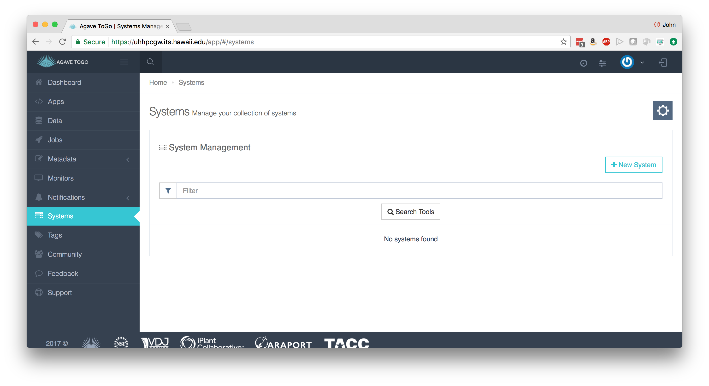

# Managing systems
---

The Agave API provides a way to access and manage the data storage and compute resources you already use (or maybe the systems you want to use), but first you have to tell Agave where they are, how to login, and how to communicate with that system.  That is done by giving Agave a short JSON description for each system.  

## Storage Systems

Storage systems tell Agave where data resides.  You can store files for running compute jobs, archive results, share files with collaborators, and maintain copies of your Agave apps on storage systems.  Agave supports many of the communication protocols and  permissions models that go along with them, so you can work privately, collaborate with individuals, or provide an open community resource.  It's up to you.  Here is an example of a simple data storage system accessed via SFTP:
```json
{
  "site": "https://uh-ci.github.io/agave-container-workshop-20180806/",
  "id": "USERNAME-workshop-vm-storage",
  "default": false,
  "status": "UP",
  "description": "Agave workshop VM storage system using SFTP on Jetstream",
  "name": "Agave Workshop SFTP Storage System",
  "available": true,
  "public": false,
  "type": "STORAGE",
  "storage": {
    "mirror": false,
    "port": 22,
    "homeDir": "/workshop",
    "protocol": "SFTP",
    "host": "VM_IPADDRESS",
    "proxy": null,
    "rootDir": "/home",
    "auth": {
      "type": "PASSWORD"
    }
  }
}
```

Within Agave ToGo, click on `Systems` in the navigation bar on the left.




### Hands-on

As a hands on exercise, using Agave ToGo, register you Jetstream VM as data storage system using PASSWORD authentication. Don't forget to replace USERNAME and VM_IPADDRESS.

For this workshop, we will also add the UH HPC Lustre filesystem but this time lets use SSHKEYs authentication as this is more secure that PASSWORD authentication, if ssh keys are cycled regularly. For the root /lus/scratch and for home /USERNAME.  See <a href="agave/uhhpc-storage.json">UHHPC Storage JSON File</a> for sample JSON.

```
ssh-keygen -t rsa -b 4096
```
The above generates some like the following:
```
Generating public/private rsa key pair.
Enter file in which to save the key (/home/seanbc/.ssh/id_rsa): new_rsa
Enter passphrase (empty for no passphrase):
Enter same passphrase again:
Your identification has been saved in new_rsa.
Your public key has been saved in new_rsa.pub.
The key fingerprint is:
ef:f5:f7:c6:07:5c:75:2f:ac:1b:91:bc:b4:8b:e5:f4 seanbc@login-0001
The key's randomart image is:
+--[ RSA 4096]----+
|                 |
|                o|
|           . o  +|
|            = o o|
|        S  . * o |
|         .  B o  |
|          .=.= o |
|         ...+.E =|
|          .   .o+|
+-----------------+
```

```
cat new_rsa
cat new_rsa.pub
```
Login into the UH HPC and copy you new_rsa.pub key into your ~/.ssh/authorized_keys file. If this file doesn't exist you can create it and set it's permissions with:
```
chmod 600 authorized_keys
```
The new ssh keys can be uploaded or pasted into the Agave ToGo now.

In the future other systems that you might register could also be a remote VMs, a storage space on a cluster at another university, or something in the commercial cloud like an S3 bucket.  

---
## Execution Systems

Execution systems in Agave are very similar to storage systems.  They just have additional information for how to launch jobs.  In this example, we are using a HPC system, so we have to give scheduler and queue information.  This system description is long, but most of it is because we are registering different queues.

```json
{
  "maxSystemJobs": 50,
  "workDir": "",
  "scratchDir": "/lus/scratch/USERNAME/",
  "type": "EXECUTION",
  "id": "",
  "description": "Execution system using ssh to submit jobs to the UH ITS HPC. By default, it uses the Sandbox queue.",
  "name": "UH ITS HPC SSH Execution Host",
  "login": {
    "port": 22,
    "protocol": "SSH",
    "host": "uhhpc1.its.hawaii.edu",
    "proxy": null,
    "auth": {
      "type": "PASSWORD"
    }
  },
  "maxSystemJobsPerUser": 10,
  "site": "hawaii.edu",
  "status": "UP",
  "scheduler": "SLURM",
  "environment": null,
  "executionType": "HPC",
  "queues": [{
    "maxProcessorsPerNode": 20,
    "default": false,
    "maxMemoryPerNode": "120GB",
    "mappedName": null,
    "description": "",
    "name": "community.q",
    "maxRequestedTime": "72:00:00",
    "maxJobs": 25,
    "customDirectives": null,
    "maxNodes": 5,
    "maxUserJobs": 5
  }, {
    "maxProcessorsPerNode": 20,
    "default": false,
    "maxMemoryPerNode": "120GB",
    "mappedName": null,
    "description": "",
    "name": "kill.q",
    "maxRequestedTime": "72:00:00",
    "maxJobs": 25,
    "customDirectives": null,
    "maxNodes": 5,
    "maxUserJobs": 5
  }, {
    "maxProcessorsPerNode": 20,
    "default": true,
    "maxMemoryPerNode": "120GB",
    "mappedName": null,
    "description": "",
    "name": "sb.q",
    "maxRequestedTime": "01:00:00",
    "maxJobs": 25,
    "customDirectives": null,
    "maxNodes": 2,
    "maxUserJobs": 5
  }, {
    "maxProcessorsPerNode": 20,
    "default": true,
    "maxMemoryPerNode": "120GB",
    "mappedName": null,
    "description": "",
    "name": "uhagave.q",
    "maxRequestedTime": "72:00:00",
    "maxJobs": 1,
    "customDirectives": null,
    "maxNodes": 1,
    "maxUserJobs": 1
  }, {
    "maxProcessorsPerNode": 20,
    "default": false,
    "maxMemoryPerNode": "120GB",
    "mappedName": null,
    "description": "",
    "name": "exclusive.q",
    "maxRequestedTime": "72:00:00",
    "maxJobs": 25,
    "customDirectives": null,
    "maxNodes": 5,
    "maxUserJobs": 5
  }],
  "public": false,
  "storage": {
    "mirror": false,
    "port": 22,
    "homeDir": "/home/USERNAME",
    "protocol": "SFTP",
    "host": "uhhpc1.its.hawaii.edu",
    "proxy": null,
    "rootDir": "/",
    "auth": {
      "type": "PASSWORD"
    }
  }
}
```

We covered what some of these keywords are in the storage systems section.  Below is some commentary on the new fields:

* **executionType** - Either HPC, Condor, or CLI.  Specifies how jobs should go into the system. HPC and Condor will leverage a batch scheduler. CLI will fork processes.
* **scheduler** - For HPC or CONDOR systems, Agave is "scheduler aware" and can use most popular schedulers to launch jobs on the system.  This field can be LSF, LOADLEVELER, PBS, SGE, CONDOR, FORK, COBALT, TORQUE, MOAB, SLURM, UNKNOWN. The type of batch scheduler available on the system.
* **environment** - List of key-value pairs that will be added to the Linux shell environment prior to execution of any command.
* **scratchDir** - Whenever Agave runs a job, it uses a temporary directory to cache any app assets or job data it needs to run the job.  This job directory will exist under the "scratchDir" that you set.  The path in this field will be resolved relative to the rootDir value in the storage config if it begins with a "/", and relative to the system homeDir otherwise.

Complete reference information is located here:
http://developer.agaveapi.co/#systems

### Hands-on
As a hands on exercise, register your Jetstream VM as a CLI execution system.  

Also register the UH HPC as an execution system using he above JSON. - Don't forget to change USERNAME to your UH username.
